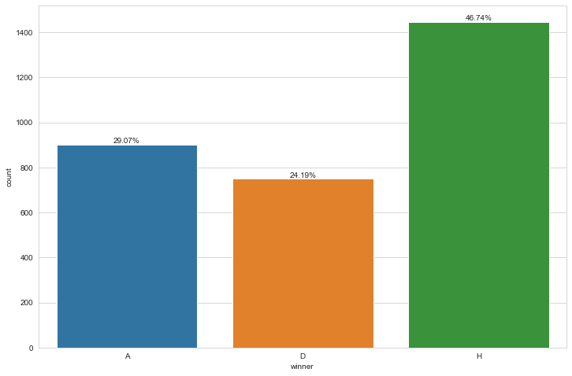
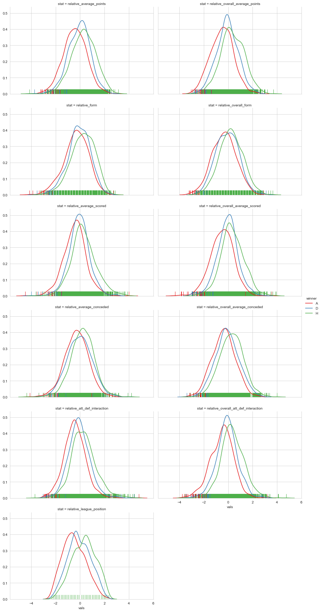

# Football Predictions

## Purpose

The purpose of this project was to use machine learning to predict premier league results. This could have many uses, for example, betting or management of a premier league team. The best model that I trained to solve this problem was a logistic regression model that predicted whether a team would win or not, this had an accuracy of 0.69.

## Technologies Used

- Python
- Numpy
- Pandas
- Matplotlib
- Seaborn
- Scipy
- Scikit-Learn
- XGBoost

## Data

The data was collected from two sources, I used an API endpoint to find the premier league fixtures for the last ten years and I found betting data for the 2019 season as a CSV file from a website. The sources of this data can be found here:

- [API Endpoint](https://www.api-football.com/)
- [Betting Data Website](https://www.football-data.co.uk/englandm.php)

For the fixtures data, I used a [Python script](scripts/match_results_api.py) to make a get request to the API endpoint and filter the data that I wanted for my analysis and then saved the raw data in CSV files for each season. The data I collected here was:

- Date
- Time
- Competition
- Home Team ID
- Home Team Name
- Away Team ID
- Away Team Name
- Home Goals
- Away Goals

[//]: # (Betting data info)

## Process

### Feature Engineering

After collecting the fixtures information I engineered features for the machine learing algorithms to use. For this I have two versions of 'fixture_processing.py', that can be found [here](scripts). Version one was the script used to create the data for my first modelling and version two was for the second modelling notebook. The features I created (that were correct at the date the matches were played) were:

- Relative score
- League position
- Average scored
- Average conceded
- Average points
- Form
- Average head to head points
- Average head to head relative score

For these statistics I calculated the season average and also the average for home/away for each team. I calculated a teams form by evaluating team's previous results and taking an average of this evaluation from the teams previous 3 matches. The evaluation of each match was formed as a combination of the oppositions league position, the result, the relative score and if the match was home or away.

### Data Analysis

I performed a brief analysis of the data I had created, these are a couple of the interesting graphs I produced:

Here I wanted to see the proportions of each result and how the features effected the result. Firstly, we have the count of results.

(H = Home Win, D = Draw, A = Away Win). We see that is it more common for the home team to win than any other result.

None of the features provided a large amount of prediction power, here we have a diagram showing the distributions of relative league position between the two teams for home wins, draws and away wins.

This graph shows that having a higher league position does make a team more likley to win but this is often not the case.

### Modelling

The modelling I performed can be found [here](notebooks). I created two versions of mhy modelling, where I used a slightly different approach in each version.

#### Version 1

Firstly, I dropped results where there was missing information and also games early in the season where some of the statistics could be unreliable. Then I found the interaction between the teams average scored and average conceded. After that I calculated relative statistics between the two teams, for example, if a team was 1st in the league and the opposition was 8th then the relative league position was 7.

In the next step, I trained machine learning models to predict the relative score. I did this to be able to include the degree of a result (i.e. a 6-0 win is more convincing than a 1-0 win). Here the best model was ridge regression model with a root mean squared error of 1.66 and a mean absolute error of 1.28.

Lastly, I trained models to predict the result of the match. Prior to training classifiers I scaled my data using a standard scaler. I used a ordinal classifier class for machine learning, this was written by Muhammad Assagaf and can be found [here](https://towardsdatascience.com/simple-trick-to-train-an-ordinal-regression-with-any-classifier-6911183d2a3c). The reason I used this class was because my results are ordinal, i.e. a loss is worse than a draw, which is worse than a win. This was used as an extension to the machine learning models, such that the multiple classification problem was transformed to two binary classification problems: 

- Binary target was 1 if result a loss and the classifier predicts V1 = 1 - Pr(Result better than loss).
- Binary target was 1 if result was a draw and the classifier predicts V2 = Pr(Result better than loss) - Pr(Result better than a draw).
- Binary target was 1 if result was a win and the classifier predicts V3 = Pr(Result was better than a draw) = 1 - V1 - V2.

The best classifier was a logistic regression model with an accuracy of 0.54.

#### Version 2

In this version I changed the format of the data to include the match from both perspectives and include a binary home feature to indicate if the match was home or away. I also changed the target of my models to be whether the team won or not instead of the result. Then I created interaction terms between all of the two teams statistics and calculated the relative of all the statistics. 

Next, I created machine learning models to predict the relative score again. Before doing so I removed features with low correlation with the target and removed sources of multicollinearity. Again, I used a ridge regression model to predict relative score. The model had a root mean squared error of 1.62 and a mean absolute error of 1.26.

The purpose of this model was to try find an effective betting strategy and therefore the evaluation metric I used was a F-beta score, with a beta of 0.5. The reason I did this was because I wanted the model to focus importance of both precision and recall but with more weight placed on precision. The best model was again a logistic regression model, with a weighted F1 score of 0.58 and an accuracy of 0.69.

I then used this model to simulate a betting strategy for the fixtures in 2019, that my model had not been trained or tested on previously. I used the model to predict the matches and used the betting data to find the best odds. My model would have made bets on 167 out of 288 games, unfortunately losing 4%. This is not hugely surprising as the betting companies are very good at predicting the probability of teams winning games and setting the odds to reflect the probability.

#### Improvements

To improve the model it would be good to include more detailed information about the teams. For example: 

- Player injuries/suspensions/transfers
- Teams having midweek games (less recovery)
- New manager information
- Detailed statistics about each match (average possession/shots/saves etc.)
